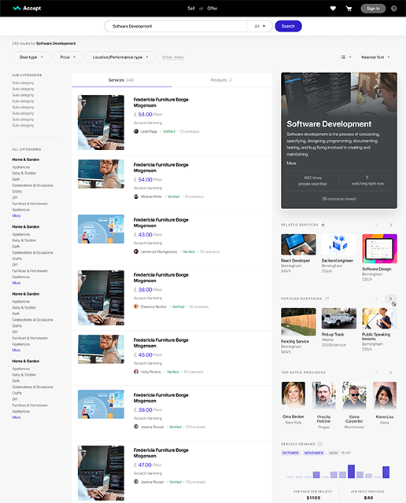

## Accept
Accept is a service running on the Ethereum network, serving as a peer-to-peer marketplace allowing users to exchange goods and services. It connects a network of traders around the globe through blockchain technology to make trading safer and more cost-effective for all parties. Accept users will be able to trade securely, privately, and anonymously in the Accept global marketplace – or locally in independent nodes - we are building a self-regulated and open-source platform, maintained and improved by its users.

https://img.shields.io/twitter/follow/accept_io?label=Follow&style=social

Supported by Dechomai and a network of global affiliates, we are proudly open source - we need as many smart people working together on this as possible.

Join the conversation on Slack. Make sure you introduce yourself in the #general channel.

Check out the User Guide for a list of features and tutorials.

    

## Dechomai&reg;

## Contributing
If you are interested in contributing to Accept in any capacity, please introduce yourself on [Slack](https://join.slack.com/t/acceptio/shared_invite/zt-ehtenv9u-aDvyCG0g02JpH5TVIJwobQ), and have a look through our GETTING_STARTED and CONTRIBUTING guides. These are the best place to start for developers looking to set up a development environment and make contributions to the codebase.

Contributing guidelines and "quick-start" instructions defined in [CONTRIBUTING.md](CONTRIBUTING.md).

## Testing
We use BrowserStack as a manual testing tool. BrowserStack provides open source projects with unlimited and free of charge accounts. A big thanks to them!

## License

Copyright (c) 2020 Dechomai, released under the AGPL [license](LICENSE).
